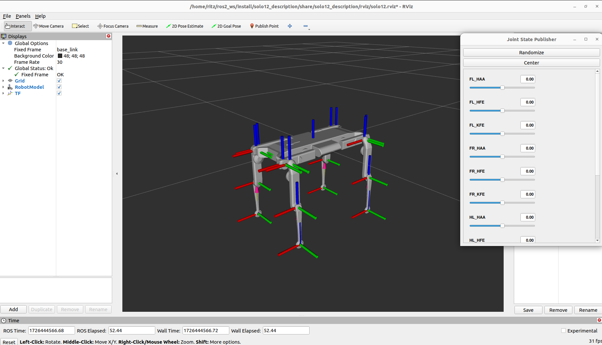
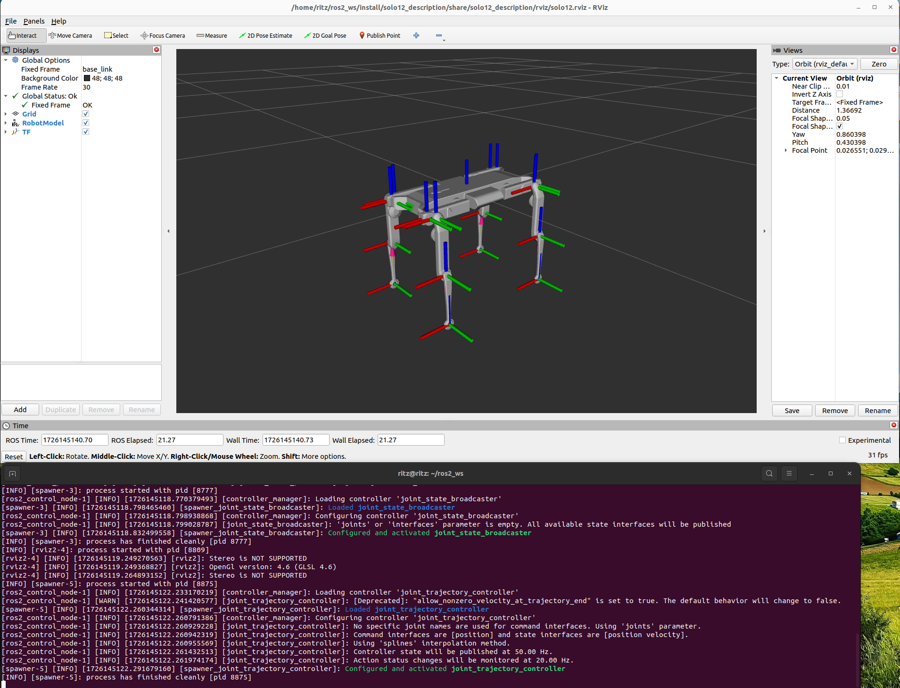

# 🚀 ss24-solo12-control

This repository supports the development and control of the **SOLO12** robot from the **Open Dynamic Robot Initiative**, leveraging the *ros2_control* framework. It includes essential packages for robot description, control, and simulation, providing a foundational structure to work with SOLO12 in ROS 2.

---

## 📥 Installing this Repository

After cloning the repository, navigate to your workspace source directory and execute the following command to install dependencies:

```bash
rosdep install --from-paths src --ignore-src -r -y
```

This will ensure that all required dependencies are installed for seamless operation.

---

## 🤖 What is *ros2_control*?

In short, *ros2_control* is a control framework for ROS 2. But actually, it is much more—it's the kernel of the ROS 2 system that controls robots:

- 🏗 **Hardware Abstraction**: It abstracts hardware and low-level control for frameworks such as MoveIt2 and Nav2.
- 🔄 **Resource Management**: Manages access to robot hardware and resources.
- 📜 **Lifecycle Control**: Controls the lifecycle of robots and their hardware components.

For more details, check [this presentation](https://control.ros.org/master/doc/resources/resources.html#ros-world-2021).

---

## 📂 Repository Structure

The repository is structured around the following main components:

### 1️⃣ Robot Description (`solo12_description`)
📌 This package contains the **URDF and XACRO files**, defining the kinematics, visual, and collision properties of the SOLO12 robot.

### 2️⃣ Bringup Package (`solo12_bringup`)
📌 This package is responsible for **launching the system**, loading robot description files, and starting the necessary controllers.

---

## 🚀 Usage

To launch the system, execute the following command:

```bash
ros2 launch solo12_bringup solo12.launch.py
```

This will bring up the **SOLO12** system with the configured controllers. For more detailed information, including available launch arguments, please refer to the `solo12_bringup` package.

### 🖥 View the Robot in Rviz2

To view the SOLO12 robot model and move its joints using the *Joint State Publisher* GUI, execute:

```bash
ros2 launch solo12_description view_solo12.launch.py
```

🖼️ **GUI Image:**


This will load the robot's **URDF** and allow interaction with the robot's joints through **Rviz2**.

---

## 🎛️ Using *ros2_control* with SOLO12

The *ros2_control* framework abstracts hardware and low-level control, providing resource management and lifecycle control for the robot. Key components include:

- 🛠 **Controller Manager**: Manages and loads controllers.
- 🎮 **Controllers**: Send commands to control the robot's joints.
- ⚙ **Resource Manager**: Manages hardware interfaces and resources.
- 🔌 **Hardware Interface**: Interfaces with physical or simulated hardware.

### 🏗 Mock Hardware Plugin

For testing and development, you can use the **Mock Hardware Plugin** to simulate robot hardware. This allows testing controllers and setup configurations **without needing real hardware** or simulation.

To run the system with mock hardware, use:

```bash
ros2 launch solo12_bringup solo12.launch.py
```

### 🏎️ Testing Controllers

To test the **joint_trajectory_controller**, run:

```bash
ros2 launch solo12_bringup controllers.launch.py
```

This will launch the controller and publish goals using `trajectory_msgs.msg.JointTrajectoryPoint`.

🖼️ **Controller Loaded Image:**


**Note:** Delay between spawning controllers is usually not necessary, but may be useful in complex setups.

---

## ❓ Troubleshooting

If you encounter the following warning after launching:

```bash
[WARNING] [launch_ros.actions.node]: Parameter file path is not a file: /path/to/source/install/solo12_bringup/share/solo12_bringup/config/solo12_controllers.yaml
```

🔧 **Fix:**

1️⃣ Locate the `solo12_controllers.yaml` file from your source directory.

2️⃣ Copy it to the specified location:

```bash
cp /path/to/source/solo12_bringup/config/solo12_controllers.yaml /path/to/source/install/solo12_bringup/share/solo12_bringup/config/
```

✅ Ensure you replace `/path/to/source/` with the actual path where the `solo12_controllers.yaml` file is located.

This should resolve the warning and allow you to proceed with launching and using the **SOLO12** robot system.

---

## 🔗 Reference

- [ROS Control Workshop 2022](https://github.com/ros-controls/roscon2022_workshop)

## 📦 Packages Overview

- **solo12_bringup**: Handles the system startup and controller management.
- **solo12_description**: Defines the robot's URDF and XACRO files.

For more detailed information about each package, please refer to the README files within the respective directories.

---

🚀 Happy coding with SOLO12! 🎉

